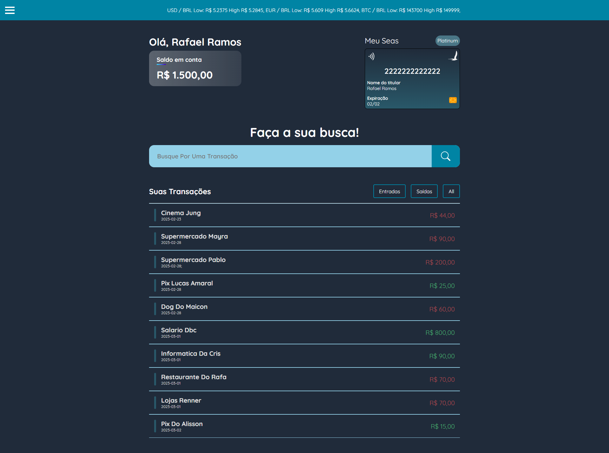

<h1 align="center"> SEAS React </h1>

Projeto desenvolvido através do programa vem ser da DBC Company durante o módulo de Testes Unitários 

  <a href="#-tecnologias">Tecnologias</a>&nbsp;&nbsp;&nbsp;|&nbsp;&nbsp;&nbsp;
  <a href="#-projeto">Projeto</a>&nbsp;&nbsp;&nbsp;|&nbsp;&nbsp;&nbsp;
  <a href="#-licença">Licença</a>

  

  <a href="https://seas-react.vercel.app">😁 -> Acesse o deploy do projeto!</a>

 

## 🚀 Tecnologias

Esse projeto foi desenvolvido com as seguintes tecnologias:

-   HTML e SASS
-   Javascript
-   Typescript
-   React Icons
-   Jest e React Testing Library
-   Git e Github

## 💻 Projeto

O objetivo da task era reconstruir a interface do SEAS Bank utilizando de React + Typescript

## 🔘 Licença

Esse projeto está sob a licença MIT.
---

Made with 💙 by Guilherme, Leonardo e Rafael.
